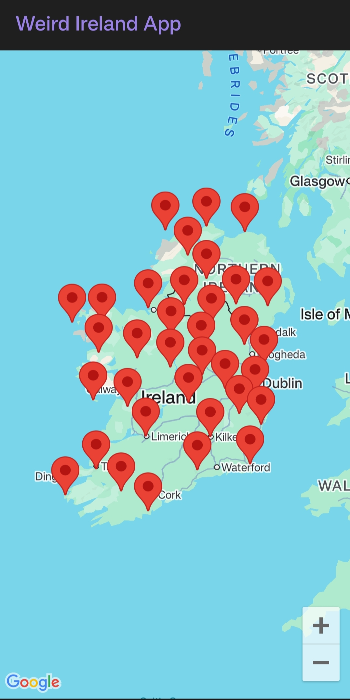
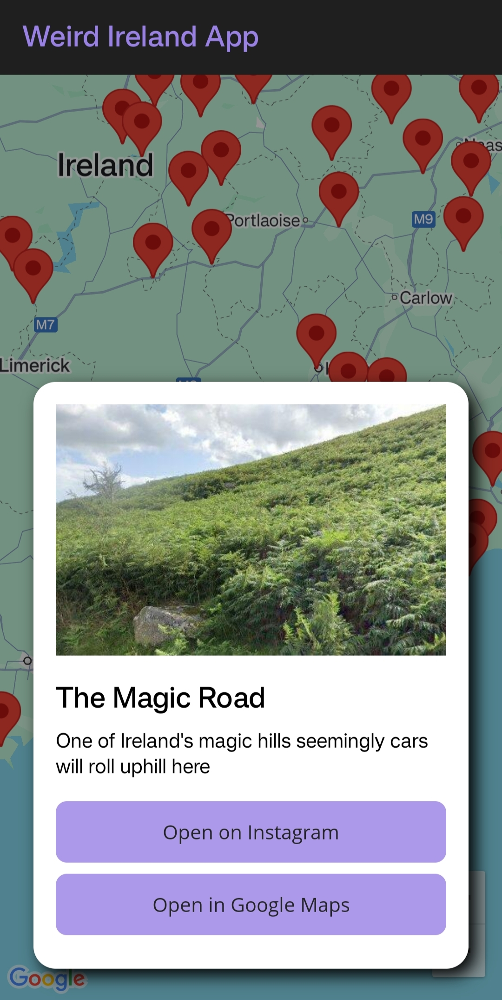

# MapInfoApp

An interactive **.NET MAUI app** that displays unusual and quirky
locations across Ireland on a map.\
Pins are loaded from a shared KML file on Google Drive, and each
location can show extra details such as **Street View images**,
**Instagram/TikTok links**, and quick access to **Google Maps
navigation**.

------------------------------------------------------------------------

## Screenshots

 
Map with clustered pins 

     

-----------------------------------------------------------------------------
Location details overlay



 -----------------------------------------------------------------------------
 
## Features

-   Interactive map of Ireland using **.NET MAUI Maps**
-   Pins dynamically loaded from a **Google Drive-hosted KML file**
-   **Google Street View preview** for each location (is available)
-   Quick open buttons:
    -   Instagram
    -   TikTok
    -   Google Maps
-   Smart pin clustering:
    -   At most **30 pins are shown at a time**
    -   Distant pins are prioritized
    -   Zoom in to reveal more detail
-   Works on Android (tested on emulator and OnePlus Nord)
-   Intended Work for iOS

------------------------------------------------------------------------

## Tech Stack

-   [.NET MAUI](https://learn.microsoft.com/dotnet/maui/what-is-maui)
    (C#)
-   [MAUI.Maps](https://learn.microsoft.com/dotnet/maui/platform-integration/maps)
-   Google Maps SDK for Android
-   Google Street View API (optional image previews)

------------------------------------------------------------------------

## Getting Started

### Prerequisites

-   [.NET 9 SDK](https://dotnet.microsoft.com/download)
-   Visual Studio 2022 (with **.NET MAUI workload**)
-   Android Emulator or physical device

### Setup

Configure secrets:
 - Copy
        `MapInfoApp/Platforms/Android/Resources/values/strings.example.xml`
        →\
        `MapInfoApp/Platforms/Android/Resources/values/strings.xml`
- Fill in your **Google Maps API key** and **Google Drive file
        ID**.

``` xml
    <resources>
        <string name="app_name">Weird Ireland App</string>
        <string name="google_maps_api_key">YOUR_GOOGLE_MAPS_API_KEY</string>
        <string name="drive_file_id">YOUR_GOOGLE_DRIVE_FILE_ID</string>
    </resources>
```

    Important: In Visual Studio, set the `Build Action` of `strings.xml`
    to `AndroidResource`.\
    This ensures the values are embedded properly into the Android
    project.

    ⚠️ Do **not** commit `strings.xml` to GitHub (it's excluded via
    `.gitignore`).


------------------------------------------------------------------------


